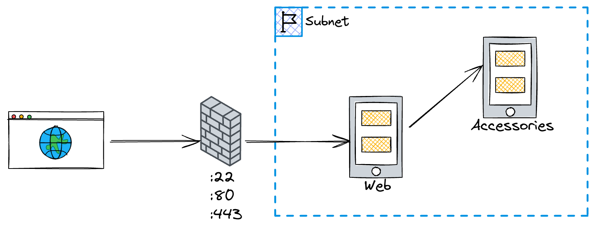

## Production-Grade (ish) server orchestration with Kamal

This is the architecture of our small cluster:



### Architecture

It creates two servers: `web` where our application lives and `accessories` where our dependencies like databases and caches live.
`web` exposes ports 80, 22 and 443, while `accessories` is not accessible from the outside. Root access is disabled on both machines and only the `kamal` user can SSH into them.
If you are copying this workflow, you should change the SSH keys in `cloudinit/{web,accessories}.yaml` to your own.

### The machines

Both machines are `CPX11`: 2 AMD vCPUs, 2 GB of RAM and 40 GB of SSD storage, running Ubuntu 20.04. See `variables.tf` for more details and how to change them.

### Price

This setup will cost you around 10 EUR/month.

### How to use it

1. Clone
2. Create a file `terraform.tfvars` with your credentials, it will look like this:

```terraform
hetzner_api_key = "your-api-key"
```
3. Run `terraform init`
4. Run `terraform plan` (optional)
5. Run `terraform apply`
